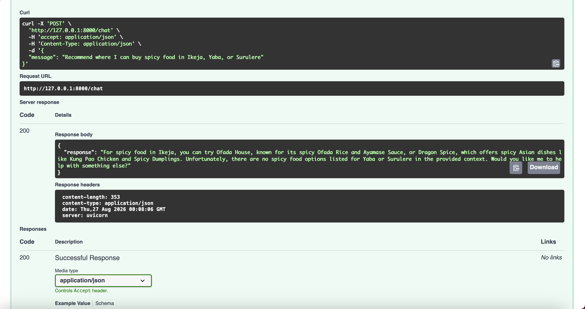
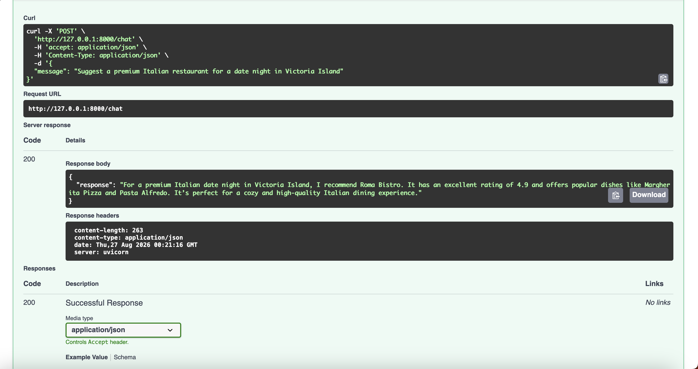
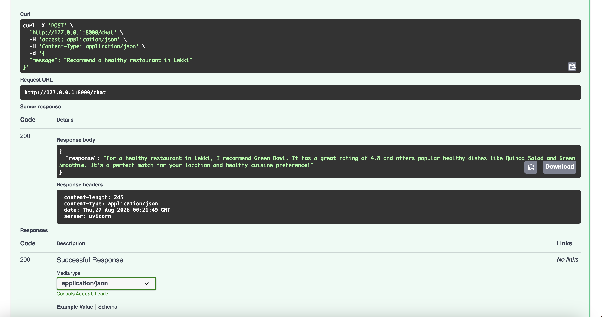
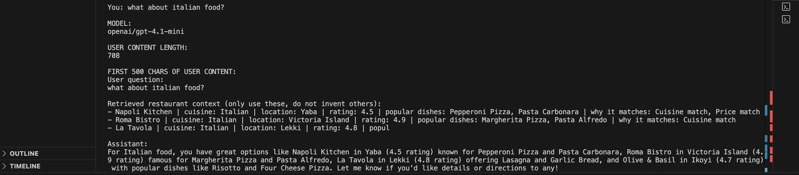
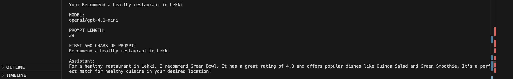

# LocalBuka AI Food Assistant

An AI-powered restaurant recommendation assistant for Lagos.

LocalBuka combines a rule-based recommendation engine with an LLM-powered conversational assistant. The system retrieves restaurants from a structured dataset, ranks them according to user preferences, and generates natural-language recommendations grounded entirely in retrieved restaurant data.

---

## Problem Statement

Finding a restaurant that matches personal preferences can be difficult.

Users often care about factors such as:

- Cuisine type
- Budget
- Location
- Dietary restrictions
- Spice preferences

LocalBuka helps users discover restaurants that best match these requirements while providing human-friendly explanations for each recommendation.

---

## Features

### Restaurant Recommendation Engine

The recommendation engine ranks restaurants based on:

- Preferred cuisine
- Price range
- Dietary restrictions
- Spice preference
- Location
- Restaurant rating

Each restaurant receives a weighted score and is ranked accordingly.

### AI Assistant

The conversational assistant:

- Understands natural-language queries
- Extracts user preferences
- Retrieves relevant restaurants
- Uses GPT through OpenRouter
- Generates grounded responses based only on retrieved restaurants

### FastAPI Backend

The project exposes API endpoints for:

- Restaurant recommendations
- Conversational interactions
- Health monitoring

---

## Architecture

```text
User Query
     |
     v
Preference Extraction
     |
     v
Restaurant Recommender
     |
     v
Top Restaurant Matches
     |
     v
Context Builder
     |
     v
GPT-4.1 Mini (OpenRouter)
     |
     v
Natural Language Response
```

---

## Project Structure

```text
localbuka-food-assistant/
│
├── app/
│   ├── assistant/
│   │   ├── assistant.py
│   │   ├── llm_client.py
│   │   └── prompts.py
│   │
│   ├── recommender/
│   │   └── recommender.py
│   │
│   ├── api/
│   │   ├── main.py
│   │   └── models.py
│   │
│   └── data/
│       └── restaurants.json
│
├── tests/
│   └── sample_users.py
│
├── README.md
├── PROJECT_PLAN.md
├── reflection.md
├── sample_outputs.md
└── requirements.txt
```

---

## Dataset

The project uses a curated dataset of Lagos restaurants.

Each restaurant contains:

```json
{
  "name": "Green Bowl",
  "cuisine": "Healthy",
  "price_range": "medium",
  "location": "Lekki",
  "rating": 4.8,
  "spice_level": "low",
  "dietary_options": ["vegetarian"],
  "popular_dishes": ["Quinoa Salad", "Green Smoothie"]
}
```

---

## Recommendation Scoring

Restaurants are ranked using a weighted scoring system.

| Factor               | Weight |
| -------------------- | ------ |
| Cuisine Match        | 35     |
| Price Match          | 25     |
| Dietary Requirements | 20     |
| Spice Preference     | 10     |
| Location Match       | 5      |
| Rating Bonus         | 0–5    |

Example:

```text
User:
Healthy food in Lekki

Restaurant:
Green Bowl

Score:
90/100
```

Reasons returned:

```text
Cuisine match
Price match
Location match
```

---

## Retrieval-First Workflow

The assistant follows a retrieval-first architecture.

### Step 1

User submits a query.

```text
Recommend a healthy restaurant in Lekki
```

### Step 2

Preferences are extracted.

```python
{
    "preferred_cuisines": ["Healthy"],
    "price_range": "medium",
    "location": "Lekki"
}
```

### Step 3

Restaurant recommendations are retrieved.

```text
Green Bowl
Fresh Roots
Fit Kitchen
```

### Step 4

Retrieved restaurants are converted into context.

```text
- Green Bowl | cuisine: Healthy | location: Lekki
- Fresh Roots | cuisine: Healthy | location: Victoria Island
- Fit Kitchen | cuisine: Healthy | location: Yaba
```

### Step 5

Only the retrieved restaurants are passed to the LLM.

This prevents hallucinations and ensures recommendations remain grounded in the dataset.

---

## API Endpoints

### Health Check

```http
GET /health
```

Response:

```json
{
  "status": "ok"
}
```

---

### Restaurant Recommendations

```http
POST /recommendations
```

Request:

```json
{
  "preferred_cuisines": ["Healthy"],
  "price_range": "medium",
  "dietary_restrictions": [],
  "likes_spicy": false,
  "location": "Lekki"
}
```

Response:

```json
{
  "recommendations": [...]
}
```

---

### Chat Endpoint

```http
POST /chat
```

Request:

```json
{
  "message": "Recommend a healthy restaurant in Lekki"
}
```

Response:

```json
{
  "response": "Green Bowl is an excellent option..."
}
```

---

## Running the Project

### Clone Repository

```bash
git clone <repo-url>
cd localbuka-food-assistant
```

### Install Dependencies

```bash
pip install -r requirements.txt
```

### Create Environment Variables

Create a `.env` file:

```env
OPENROUTER_API_KEY=your_api_key_here
```

### Start the API

```bash
uvicorn app.api.main:app --reload
```

### Open Swagger Docs

```text
http://127.0.0.1:8000/docs
```

---

## Demo

### Swagger API







### Chat Example





---

## Example Conversation

### User

```text
Recommend a healthy restaurant in Lekki
```

### Assistant

```text
Green Bowl is a strong match because it serves healthy cuisine,
is located in Lekki, and has a high rating of 4.8.

Popular dishes include:
- Quinoa Salad
- Green Smoothie

You may also consider Fresh Roots and Fit Kitchen.
```

---

## Technologies Used

### Backend

- Python
- FastAPI

### AI

- OpenRouter
- GPT-4.1 Mini

### Data

- JSON

### Development

- Uvicorn
- Requests
- Python Dotenv

---

## Challenges Encountered

### OpenRouter Rate Limits

Free OpenRouter models frequently returned 429 errors. The solution was to switch to a paid model and implement retry logic.

### SSL/TLS Connection Errors

While integrating OpenRouter, intermittent SSL errors occurred. The issue was traced to cached Python artifacts and resolved by clearing **pycache** directories and rebuilding the environment.

### Grounding LLM Responses

Early versions allowed the model to recommend restaurants that did not exist in the dataset.

The solution was to implement a retrieval-first workflow where only retrieved restaurant information is passed to the model.

## Future Improvements

Planned enhancements include:

- Unit and integration tests
- Docker support
- Vector search
- Semantic restaurant retrieval
- User preference memory
- Personalized ranking
- Restaurant review analysis
- Hybrid retrieval (rules + embeddings)

---

## Reflection

This project demonstrates several AI engineering concepts:

- Retrieval-first system design
- Recommendation systems
- Prompt grounding
- LLM integration
- API development
- Structured context generation
- Hallucination reduction through retrieval

A key lesson from the project was that LLMs perform significantly better when grounded with retrieved context instead of relying solely on prompts.

---

## Author

**Elvis Anselm**

GitHub: https://github.com/Elvaceishim
